# 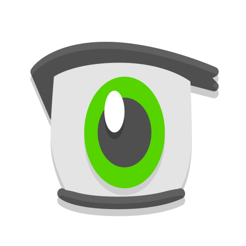 Icons

<div align="center">


**A curated collection of 60,000+ icons for developers, designers, and power users**

*Icons for apps, folders, services, programming languages, and beyond*

---

</div>

##  Structure

<details>
<summary><strong>Click to expand directory structure</strong></summary>

```
Icons/
├── color/              # Full-color icons
│   ├── library/        # 7,000+ categorized icons (PNG + SVG)
│   │   ├── png/        # Developer, AI, design, social, databases...
│   │   └── svg/        # Vector versions of library icons
│   ├── self-hosted/    # 1,000+ self-hosted service icons
│   ├── web/            # 1,400+ web service icons (PNG + SVG)
│   ├── papirus/        # Papirus icon theme (apps, devices, mimetypes)
│   ├── flags/          # 262 country flags
│   ├── os/             # Operating system icons
│   ├── dev/            # Development tool icons
│   ├── km/             # Keyboard Maestro icons
│   ├── metabrainz/     # MusicBrainz ecosystem icons
│   └── misc/           # Miscellaneous color icons
│
├── plain/              # Monochrome & line icons
│   ├── tabler/         # 5,219 Tabler icons (PNG + SVG)
│   ├── simple/         # 3,097 Simple Icons (brand logos, SVG)
│   ├── logos/          # 6,196 brand logos (PNG + SVG)
│   ├── font-awesome/   # 4,074 Font Awesome icons
│   │   ├── brands/     # Brand icons
│   │   ├── regular/    # Regular style
│   │   └── solid/      # Solid style
│   ├── remix/          # 2,860 Remix icons (PNG + SVG)
│   ├── boxicons/       # 3,268 Boxicons (PNG + SVG)
│   ├── lucide/         # 1,447 Lucide icons (SVG)
│   ├── octicons/       # 1,208 GitHub Octicons (PNG + SVG)
│   ├── feather/        # 574 Feather icons (PNG + SVG)
│   ├── coolicons/      # 1,769 Coolicons (PNG + SVG)
│   ├── rpg-awesome/    # 990 RPG & gaming icons
│   ├── papirus/        # Papirus plain icons
│   ├── brew/           # Homebrew package icons
│   ├── car-badges/     # Car manufacturer badges
│   └── misc/           # Additional plain icons
│
├── macos/              # macOS-specific assets
│   ├── apps/           # 2,500+ app icons (ICNS + PNG)
│   ├── folders/        # 4,000+ folder icons
│   │   ├── branded/    # Branded folder variations
│   │   ├── colors/     # Color-coded folders
│   │   ├── default/    # Default macOS style
│   │   └── misc/       # Miscellaneous folder icons
│   └── misc/           # System & utility icons
│
├── linux/              # Linux icon themes
│   ├── chameleon/      # Chameleon icon theme (7,000+ icons)
│   ├── deepin/         # Deepin icon theme (10,000+ icons)
│   ├── solarized/      # Solarized color scheme icons
│   ├── tahoe/          # Tahoe icon theme (SVG)
│   ├── usos/           # USOS icon theme (3,900+ SVG icons)
│   ├── windows10/      # Windows 10 style icons (6,100+ icons)
│   ├── distros/        # Linux distribution logos
│   ├── refind/         # rEFInd bootloader icons
│   └── tux/            # Tux (Linux mascot) variations
│
├── misc/               # Miscellaneous collections
│   ├── ai/             # AI service icons (colorful, filled, outlined)
│   ├── band-logos/     # 324 band/artist logos (SVG)
│   ├── rings/          # 129 circular badge icons
│   ├── record-colors/  # Record/vinyl color icons
│   ├── bulk/           # Bulk icon collection
│   └── misc/           # Music & media service icons
│
├── new/                # Newly added icons
│   ├── food/           # Food brand icons
│   └── svg/            # New SVG icons
│
└── utilities/          # Tools & scripts
    ├── scripts/         # Icon management scripts
    │   ├── bulk-download-icons.sh
    │   ├── get-largest-size.sh
    │   ├── apply-icon.sh
    │   ├── svg-to-png.sh
    │   └── convert-to-icns.sh
    ├── keyboard-maestro-actions/  # Keyboard Maestro action icons
    ├── applications/    # Icon management applications
    └── folder-templates/ # Folder icon templates
```

</details>

---

##  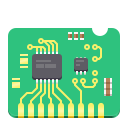 Collections

### Color Icons

| Category | Count | Description | Preview |
|----------|-------|-------------|---------|
| **Library (Developer)** | 1,877 | Languages, frameworks, tools, IDEs (PNG) | 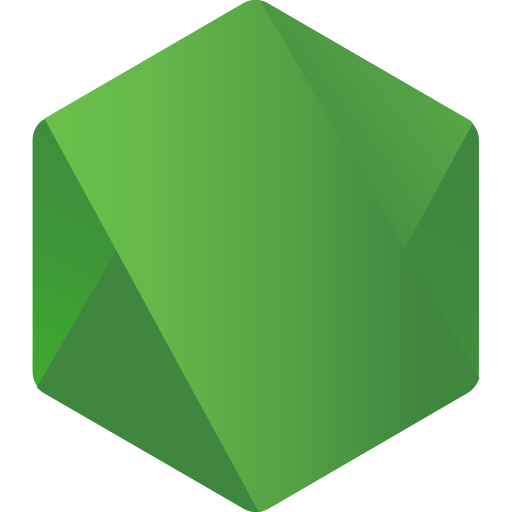 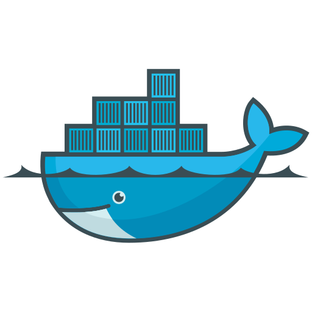   |
| **Library (Software)** | 1,119 | Desktop applications & utilities (PNG) | 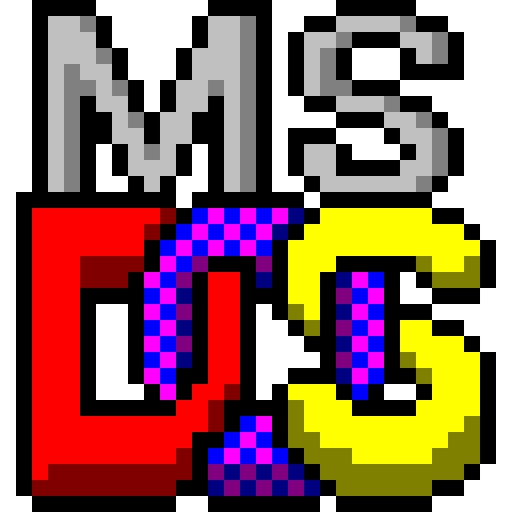    |
| **Library (SVG)** | 2,000+ | Vector versions of library icons |     |
| **Self-Hosted** | 1,030 | Self-hosted service icons | 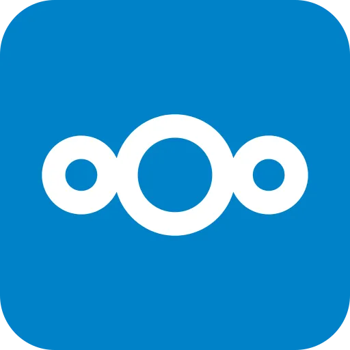 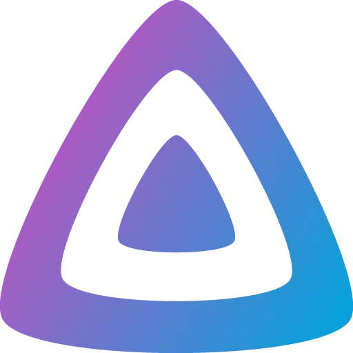  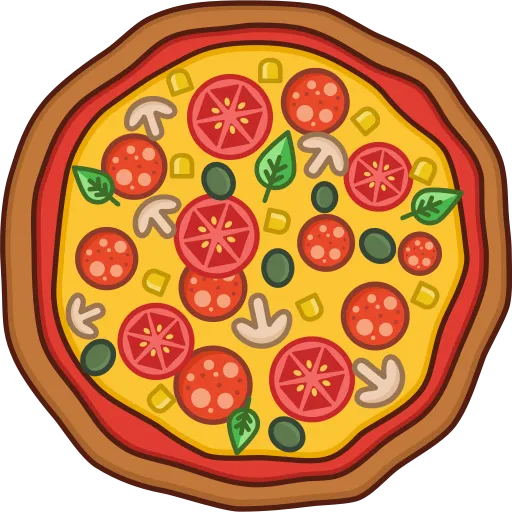 |
| **Web Services** | 1,400+ | Web service icons (PNG + SVG) |  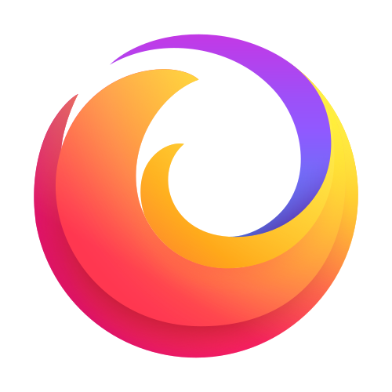 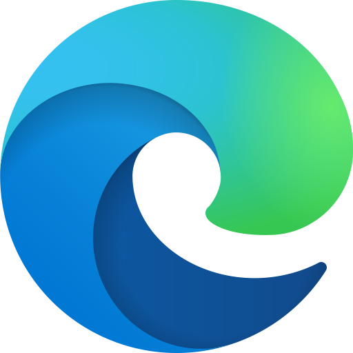  |
| **Papirus** | 2,400+ | Papirus icon theme (apps, devices, mimetypes) |     |
| **Flags** | 262 | Country flags | 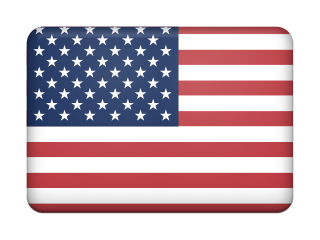  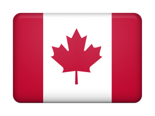 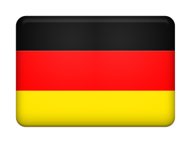 |
| **AI** | 50+ | ChatGPT, Claude, Copilot, Midjourney... | 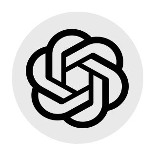    |
| **Social** | 75+ | Twitter, Discord, Reddit, LinkedIn... |     |
| **Browser** | 20+ | Chrome, Firefox, Arc, Brave, Safari... |  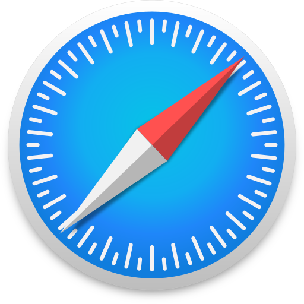   |
| **Database** | 68+ | PostgreSQL, MongoDB, Redis, MySQL... |    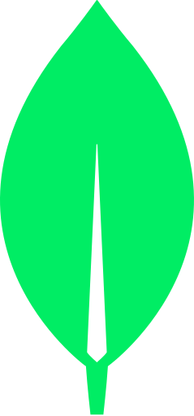 |
| **Design** | 45+ | Figma, Adobe suite, Sketch, Canva... |     |
| **Crypto** | 39+ | Bitcoin, Ethereum, Solana, wallets... |  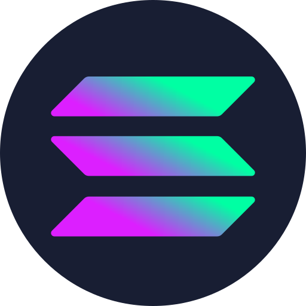 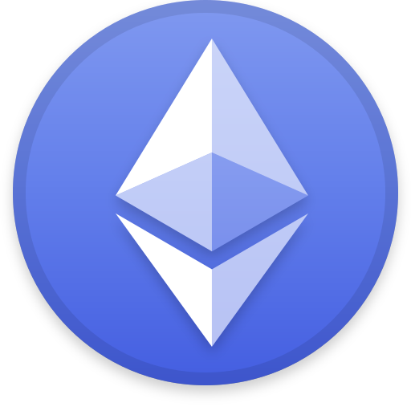 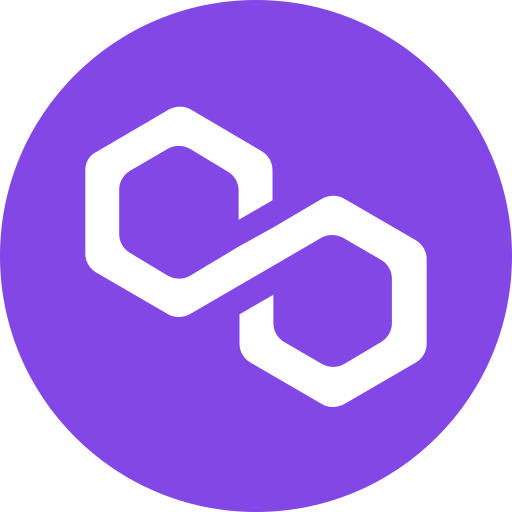 |
| **OS** | 109 | Operating system icons |    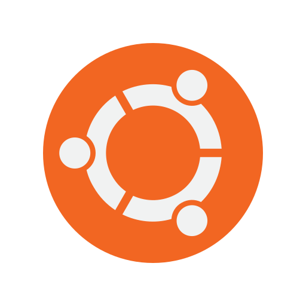 |

### Plain Icons

| Set | Icons | Format | Style | Preview |
|-----|-------|--------|-------|---------|
| **Tabler** | 5,219 | PNG + SVG | Outline & filled |     |
| **Simple Icons** | 3,097 | SVG | Brand logos |     |
| **Logos** | 6,196 | PNG + SVG | Developer brands |     |
| **Font Awesome** | 4,074 | PNG + SVG | Brands, regular, solid |     |
| **Boxicons** | 3,268 | PNG + SVG | Regular, solid, logos |     |
| **Remix** | 2,860 | PNG + SVG | Line & fill |     |
| **Lucide** | 1,447 | SVG | Clean line icons |     |
| **Coolicons** | 1,769 | PNG + SVG | Modern line icons |     |
| **Octicons** | 1,208 | PNG + SVG | GitHub style |     |
| **RPG Awesome** | 990 | PNG + SVG | Gaming & RPG icons |     |
| **Feather** | 574 | PNG + SVG | Minimal strokes |     |
| **Brew** | 568 | PNG + SVG | Homebrew package icons |     |
| **Car Badges** | 172 | PNG + SVG | Car manufacturer logos |     |

### macOS Assets

| Category | Count | Formats | Preview |
|----------|-------|---------|---------|
| **App Icons** | 2,500+ | `.icns` `.png` |     |
| **Branded Folders** | 3,500+ | `.icns` `.png` | 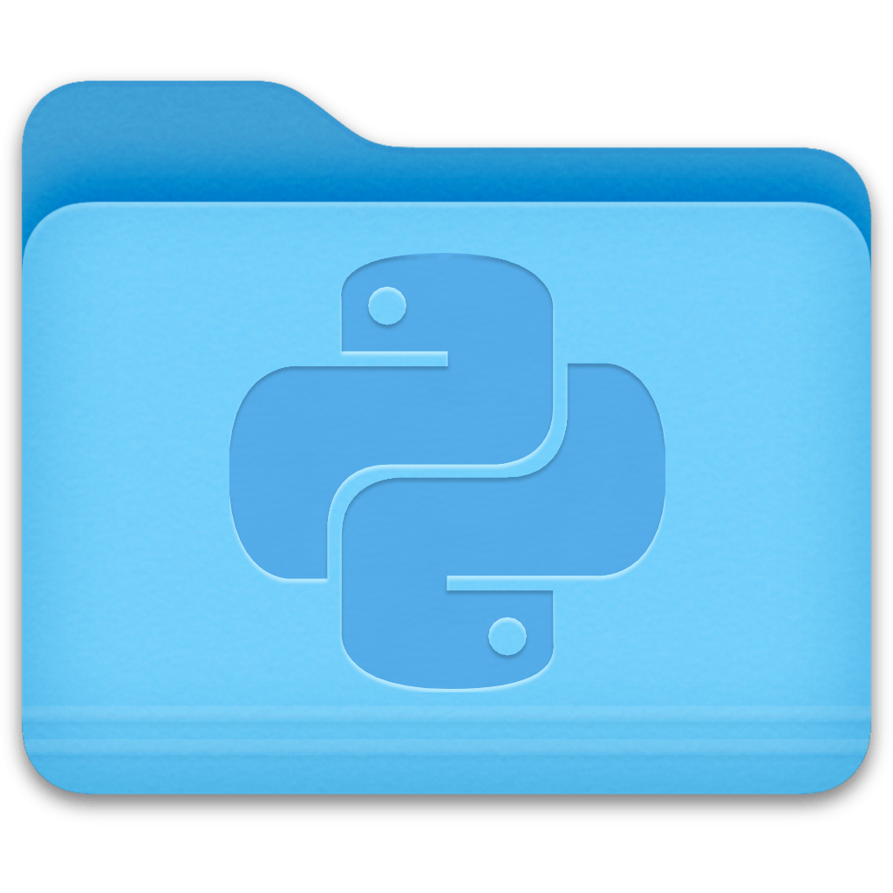 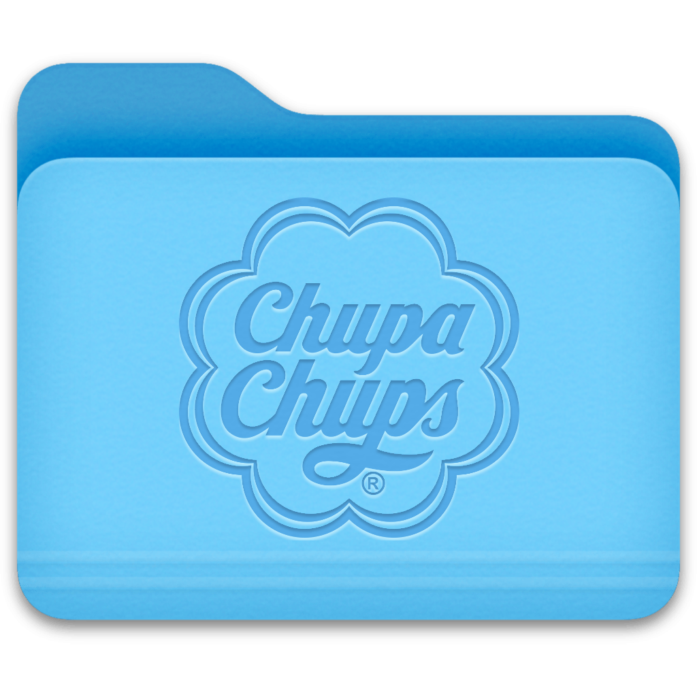   |
| **Color Folders** | 270+ | `.icns` |  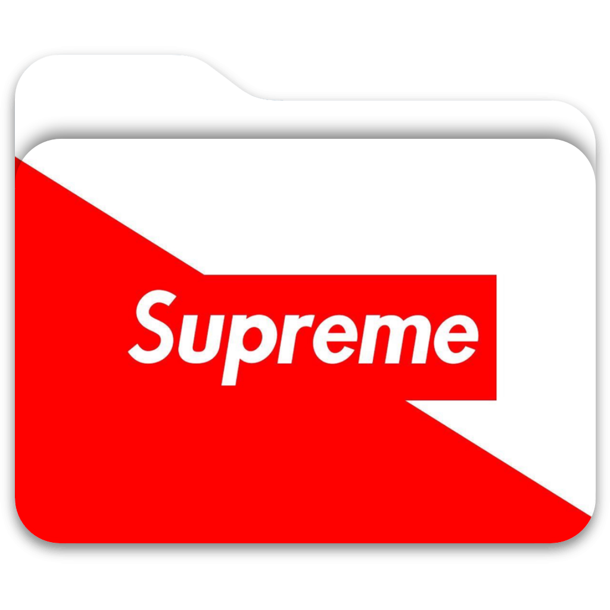  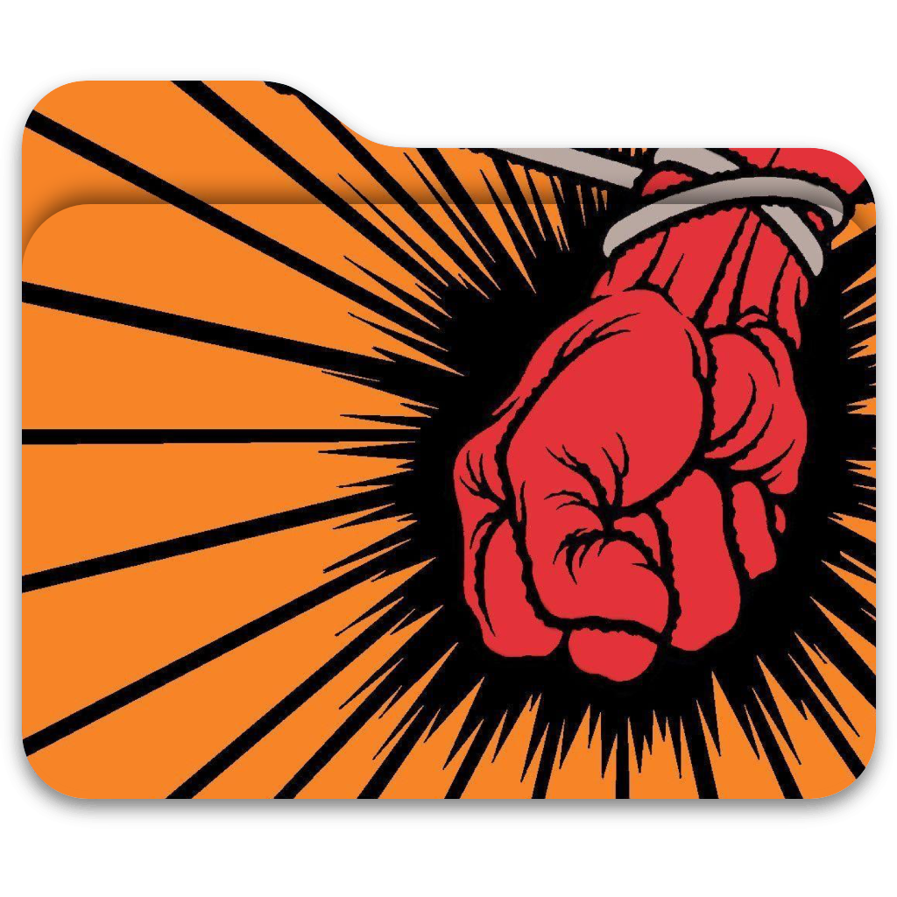 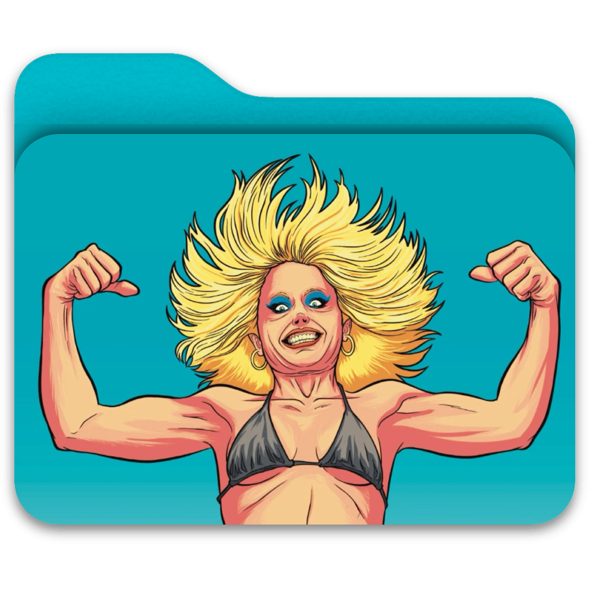   |
| **Default Folders** | 90+ | `.icns` `.png` | 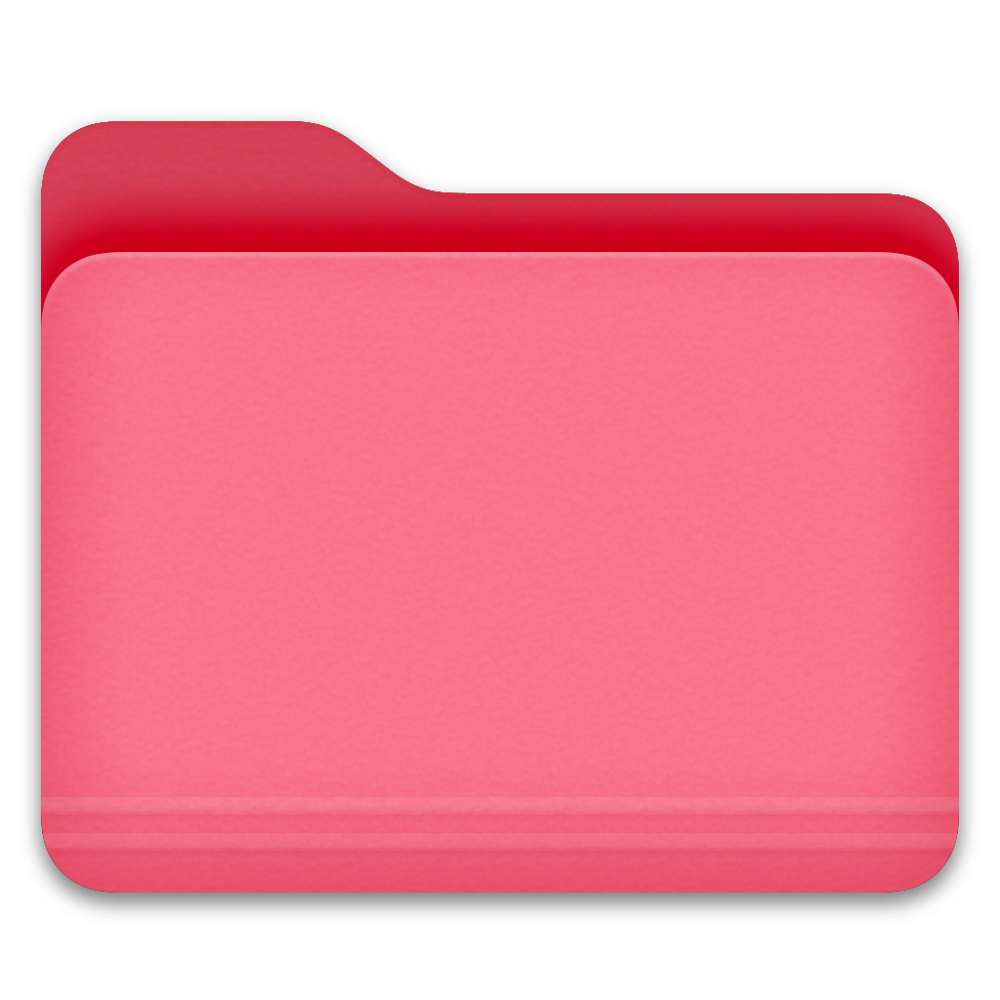 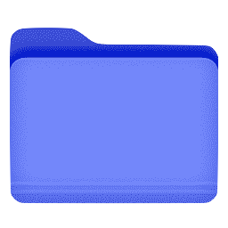   |

### Linux Icon Themes

| Theme | Icons | Format | Description |
|-------|-------|--------|-------------|
| **Deepin** | 10,000+ | PNG + SVG | Complete desktop icon theme |
| **Windows 10** | 6,100+ | PNG + SVG | Windows 10 style icons |
| **Chameleon** | 7,000+ | PNG + SVG | Colorful icon theme |
| **USOS** | 3,900+ | SVG | Modern flat icon theme |
| **Tahoe** | 2,200+ | SVG | Minimalist icon theme |
| **Solarized** | 2,600+ | PNG + SVG | Solarized color scheme |
| **Distros** | 200+ | PNG + SVG | Linux distribution logos |

---

##  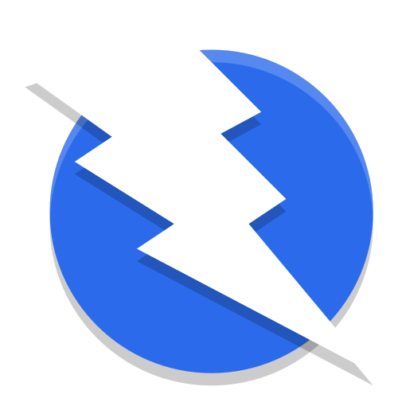 Usage

### Applying macOS Folder Icons

```bash
# Using fileicon (brew install fileicon)
fileicon set ~/Projects/MyApp ./macos/folders/branded/github.icns

# Using included script
./utilities/scripts/apply-icon.sh github.icns ~/Projects/MyApp

# Or via Finder
# 1. Get Info on icon file (⌘ + I)
# 2. Click icon preview → Copy (⌘ + C)
# 3. Get Info on target folder
# 4. Click folder icon → Paste (⌘ + V)
```

### Applying App Icons

```bash
# Replace app icon
fileicon set /Applications/MyApp.app ./macos/apps/icns/custom-icon.icns

# Using included script
./utilities/scripts/apply-icon.sh custom-icon.icns /Applications/MyApp.app

# Refresh icon cache
sudo killall Finder && sudo killall Dock
```

### Using in Web Projects

```html
<!-- SVG inline -->


<!-- As favicon -->
<link rel="icon" href="color/library/png/browser/chrome.png">
```

**Example icons:**
-  [Kubernetes](plain/simple/kubernetes.svg)
-  [PSX](color/misc/psx.png)
-  [NZB-Dav](color/self-hosted/nzb-dav.png)
-  [D.R.I](color/misc/prohibit-dancing.png)
-  [Firefox](color/library/png/browser/firefox.png)

### Converting Icons

```bash
# Convert SVG to PNG (512px width)
./utilities/scripts/svg-to-png.sh icon.svg -w 512

# Convert PNG to ICNS for macOS
./utilities/scripts/convert-to-icns.sh icon.png

# Batch convert all SVGs in directory
./utilities/scripts/svg-to-png.sh ./icons -b -w 512
```

See [`utilities/scripts/README.md`](utilities/scripts/README.md) for complete script documentation.

---

##  Icon Sets Included

<details>
<summary><strong>Open Source Icon Libraries</strong></summary>

| Library | License | Link |
|---------|---------|------|
| Tabler Icons | MIT | [tabler.io/icons](https://tabler.io/icons) |
| Simple Icons | CC0 1.0 | [simpleicons.org](https://simpleicons.org) |
| Lucide | ISC | [lucide.dev](https://lucide.dev) |
| Feather Icons | MIT | [feathericons.com](https://feathericons.com) |
| Font Awesome | Various | [fontawesome.com](https://fontawesome.com) |
| Octicons | MIT | [primer.style/octicons](https://primer.style/octicons) |
| Remix Icons | Apache 2.0 | [remixicon.com](https://remixicon.com) |
| Boxicons | MIT | [boxicons.com](https://boxicons.com) |
| Coolicons | CC BY 4.0 | [coolicons.cool](https://coolicons.cool) |
| RPG Awesome | BSD | [nagoshiashumern.github.io/Rpg-Awesome](https://nagoshiashumern.github.io/Rpg-Awesome) |

</details>

---

## 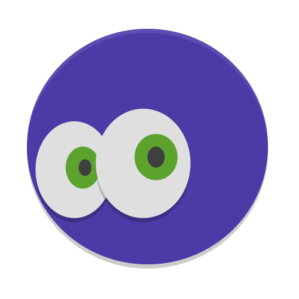Quick Reference

```
60,000+ total icons
├── PNG:   40,000+
├── SVG:   18,000+
├── ICNS:   2,000+
└── EPS:      142
```

**Major Collections:**
- **Color Icons**: 7,000+ library icons, 1,000+ self-hosted, 1,400+ web services
- **Plain Icons**: 30,000+ monochrome icons across 15+ icon sets
- **macOS Assets**: 2,500+ app icons, 4,000+ folder icons
- **Linux Themes**: 30,000+ icons across 7+ icon themes
- **Miscellaneous**: 500+ AI icons, 300+ band logos, 100+ food icons

**Categories covered:**
`development` `programming` `frameworks` `databases` `cloud` `ai` `design` `browsers` `social` `crypto` `music` `gaming` `self-hosted` `macos` `folders` `apps` `linux` `themes` `flags` `brands`

---

## ️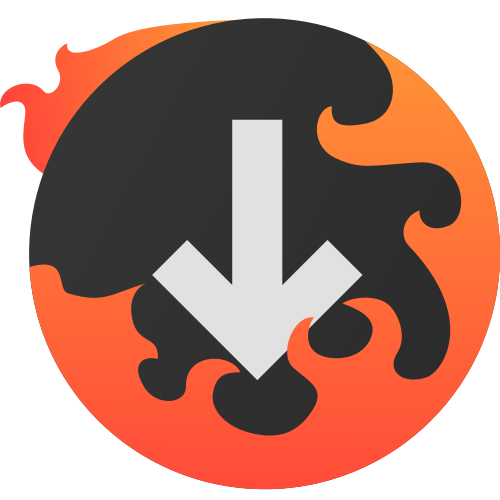 Utilities

This repository includes professional command-line tools for managing icons:

- **`bulk-download-icons.sh`** - Download icon packs with parallel downloads and retries
- **`get-largest-size.sh`** - Analyze image sizes and find largest icons
- **`apply-icon.sh`** - Apply icons to macOS folders and applications
- **`svg-to-png.sh`** - Convert SVG files to PNG with aspect ratio preservation
- **`convert-to-icns.sh`** - Convert images to macOS ICNS format

All scripts include comprehensive help (`--help`), error handling, and progress reporting. See [`utilities/scripts/README.md`](utilities/scripts/README.md) for detailed documentation.

### Keyboard Maestro Actions

Curated action icons organized for Keyboard Maestro macros:
- **Text actions** - Programming languages and text processing icons
- **Visibility actions** - Show/hide and communication service icons
- **File actions** - File management and development workflow icons
- **System actions** - Terminal, editor, and system action icons

See [`utilities/keyboard-maestro-actions/README.md`](utilities/keyboard-maestro-actions/README.md) for details.

##   Tips

- **High-resolution PNGs** are in `color/library/png/` — great for presentations
  - Example:  [Node.js PNG](color/library/png/developer/nodejs.png)
- **macOS folder icons** work best in `.icns` format from `macos/folders/`
  - Example:  [Python Folder](macos/folders/branded/png/python.png)
- **Brand logos** in SVG format are in `plain/simple/` for perfect scaling
  - Examples:   
- **Linux icon themes** in `linux/` can be used for desktop customization
- **Dark mode variants** are available in `*/dark/` subdirectories where applicable
- **Use included scripts** for batch processing and format conversion
- **AI icons** available in multiple styles:   

---

<div align="center">
*Collected and organized for quick access*

****

</div>
