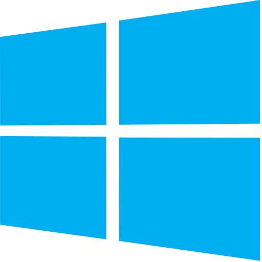
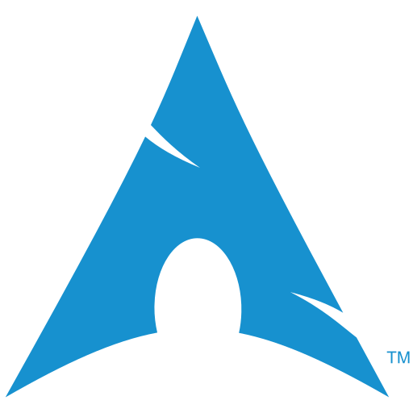
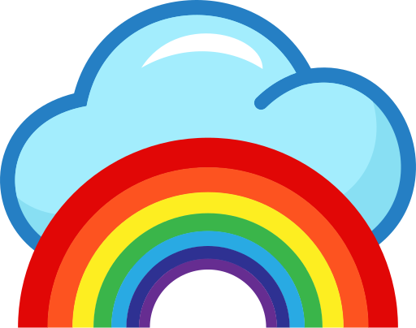
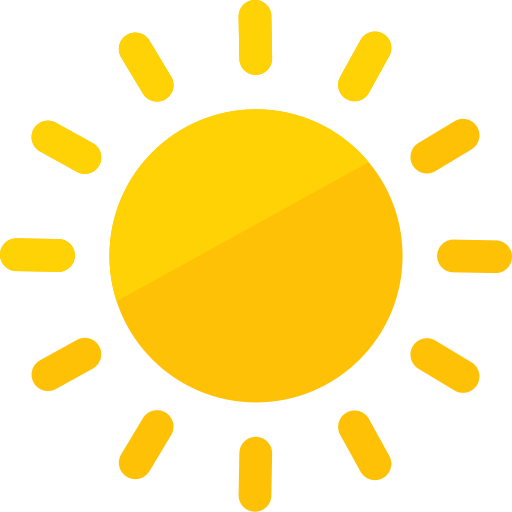
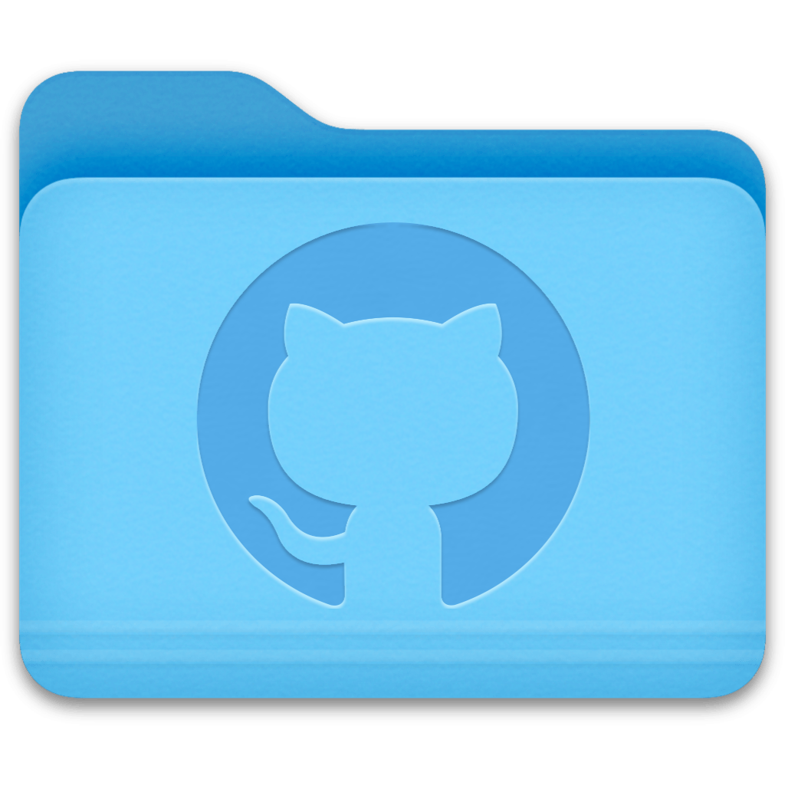

# Iconography

<div align="center">


<br>


**A curated collection of 589,000+ icons for developers, designers, and power users**

[About](#-about) • [Structure](#-structure) • [Collections](#--collections) • [Usage](#--usage) • [Icon Sets](#--icon-sets-included) • [Quick Reference](#-quick-reference)

</div>

---

## 🗂️ About

A comprehensive collection of 589,000+ icons spanning color PNGs, monochrome SVG sets, macOS ICNS assets, and 226 icon set collections via the Iconify API submodule. Icons for apps, folders, services, programming languages, and beyond.

---

##  Structure

<details>
<summary><strong>Click to expand directory structure</strong></summary>

```
Iconography/
├── _new/                 # Staging for new icons
├── category/             # 30+ thematic categories (moved from color/)
│   ├── animals/ brands/ developer/ flags/ self-hosted/
│   ├── web/ weather/ traffic/ social media/ ... 25+ more
├── color/                # Colorful icon sets (PNG, SVG)
│   ├── ai/               # AI-themed (png/ svg/ webp/)
│   ├── distros/          # Linux distribution icons
│   ├── km/               # Keyboard Maestro (bulk/ fluent/ logos/ etc.)
│   ├── library/          # 23+ dev tool categories
│   │   ├── browser/ cms/ community/ compiler/ crypto/
│   │   ├── database/ design/ developer/ devtool/ education/
│   │   ├── entertainment/ framework/ google/ hosting/
│   │   ├── language/ library/ marketplace/ microsoft/
│   │   ├── music/ payment/ social/ software/ svg/
│   ├── music/            # Music-related
│   ├── papirus/          # Papirus theme
│   └── windows98/        # Retro Windows 98 icons
├── distro-packs/         # 9 Linux desktop icon themes (74k files)
├── file-types/           # File format icons, 15 style variants (3k files)
├── gifs/                 # Animated GIFs
├── iconify/              # 226 icon sets via Iconify API (331k files, 2GB)
│   ├── carbon/ codicon/ tabler/ material/ boxicons/ ... 220+ more
├── macos/                # macOS ICNS + PNG assets (5k files)
│   ├── apps/             # Application icons
│   ├── drives/           # Volume icons
│   └── folders/          # Folder customization (branded/ colors/ default/)
├── misc/                 # Loose miscellaneous icons
├── packs/                # Curated icon packs (15 directories)
│   ├── azure/ flat/ food/ google/ raycast/ servers/ simplicio/ ...
├── plain/                # Monochrome icon sets (50k files)
│   ├── adobelightroom/ brew/ car-badges/ coolicons/ figma/
│   ├── logos/ remix/ rpg-awesome/ spotify/ tabler/ ...
├── sf-symbols/           # Apple SF Symbols (dark + light, 22 categories)
└── utilities/            # Scripts, folder templates, KM actions
    ├── folders/          # Folder templates (icns/ png/ svg/)
    ├── kb-maestro-actions/  # KM action bundles
    └── scripts/          # apply-icon.sh, svg-to-png.sh, etc.
```

</details>

---

##   Collections

### Color Icons

| Category | Count | Description | Preview |
|----------|-------|-------------|---------|
| **Library (Developer)** | 1,877 | Languages, frameworks, tools, IDEs (PNG) |       |
| **Library (Software)** | 1,119 | Desktop applications & utilities (PNG) |       |
| **Self-Hosted** | 1,030 | Self-hosted service icons |       |
| **Web Services** | 1,380+ | Web service icons (PNG + SVG) |       |
| **Papirus** | 2,380+ | Papirus icon theme (apps, devices, mimetypes) |       |
| **Flags** | 262 | Country flags |       |
| **AI** | 50+ | ChatGPT, Claude, Copilot, Midjourney... |       |
| **Social** | 75+ | Twitter, Discord, Reddit, LinkedIn... |       |
| **Browser** | 20+ | Chrome, Firefox, Arc, Brave, Safari... |       |
| **Database** | 68+ | PostgreSQL, MongoDB, Redis, MySQL... |       |
| **Design** | 45+ | Figma, Adobe suite, Sketch, Canva... |       |
| **Crypto** | 39+ | Bitcoin, Ethereum, Solana, wallets... |       |
| **OS** | 109 | Operating system icons |       |
| **Audio** | 500+ | Music, media, and hardware icons |       |
| **Food & Drink** | 400+ | Food, beverages, and organic signs |       |
| **Nature** | 300+ | Plants, environment, and earth icons |       |
| **Weather** | 200+ | Meteorological and seasonal icons |       |
| **Brands** | 2,000+ | Global brand and corporate logos |       |
| **Misc** | Various | Miscellaneous icons |       |


### macOS Assets

| Category | Count | Formats | Preview |
|----------|-------|---------|---------|
| **Color Folders** | 270+ | `.icns` |                   |
| **App Icons** | 2,500+ | `.icns` `.png` |          |
| **Branded Folders** | 3,500+ | `.icns` `.png` |          |
| **Default Folders** | 90+ | `.icns` `.png` |          |


### Plain Icons

| Set | Icons | Format | Style | Preview |
|-----|-------|--------|-------|---------|
| **Logos** | 5,879 | PNG + SVG | Brand marks |     |
| **Remix Icon** | 5,557 | PNG + SVG | Line & fill |     |
| **Coolicons** | 1,776 | PNG + SVG | Modern line |     |
| **RPG Awesome** | 990 | PNG + SVG | Gaming & RPG |     |
| **Brew** | 568 | PNG + SVG | Homebrew |     |
| **Car Badges** | 172 | PNG + SVG | Automotive |     |
| **Adobe Lightroom** | 1,148 | PNG + SVG | Photo editing |     |
| **vMix** | 256 | PNG | Broadcast |     |
| **Figma** | 204 | PNG + SVG | Design tool |     |
| **Default** | 228 | PNG + SVG | System style |     |
| **various smaller sets** | — | PNG + SVG | See directory | apple-music/ avidmedia/ color-matrix/ line/ spotify/ streamlabs/ teal/ txt/ web/ |


### Linux Icon Themes

| Theme | Icons | Format | Description |
|-------|-------|--------|-------------|
| **Deepin** | 12,916 | PNG + SVG | Complete Deepin desktop icon theme |
| **Manasarovar** | 9,775 | PNG + SVG | Manasarovar icon theme |
| **Kora** | 9,774 | PNG + SVG | Kora icon theme |
| **Pebble** | 5,834 | PNG + SVG | Pebble icon theme |
| **Papirus Remix** | 5,154 | PNG + SVG | Papirus remix variant |
| **Flat Remix** | 4,267 | PNG + SVG | Flat Remix icon theme |
| **mac** | 3,790 | PNG + SVG | macOS-like icon theme |
| **Hatter** | 2,002 | PNG + SVG | Hatter icon theme |
| **Argon** | 313 | PNG + SVG | Argon icon theme |

---

##   Usage

### Applying macOS Folder Icons

```bash
# Using fileicon (brew install fileicon)
fileicon set ~/Projects/MyApp ./macos/folders/branded/github.icns

# Using included script
./utilities/scripts/apply-icon.sh github.icns ~/Projects/MyApp

# Or via Finder
# 1. Get Info on icon file (⌘ + I)
# 2. Click icon preview → Copy (⌘ + C)
# 3. Get Info on target folder
# 4. Click folder icon → Paste (⌘ + V)
```

### Applying App Icons

```bash
# Replace app icon
fileicon set /Applications/MyApp.app ./macos/apps/icns/custom-icon.icns

# Using included script
./utilities/scripts/apply-icon.sh custom-icon.icns /Applications/MyApp.app

# Refresh icon cache
sudo killall Finder && sudo killall Dock
```

### Using in Web Projects

```html
<!-- SVG inline -->


<!-- As favicon -->
<link rel="icon" href="color/library/browser/chrome.png">
```

**Example icons:**
-  [Kubernetes](category/web/kubernetes.png)
-  [PSX](misc/psx.png)
-  [NZB-Dav](category/self-hosted/nzb-dav.png)
-  [Firefox](color/library/browser/firefox.png)
-  [Claude](color/ai/png/claude.png)
-  [Copilot](color/ai/png/copilot.png)
-  [Spotify](color/music/spotify.png)

### Converting Icons

```bash
# Convert SVG to PNG (512px width)
./utilities/scripts/svg-to-png.sh icon.svg -w 512

# Convert PNG to ICNS for macOS
./utilities/scripts/convert-to-icns.sh icon.png

# Batch convert all SVGs in directory
./utilities/scripts/svg-to-png.sh ./icons -b -w 512
```

See [`utilities/scripts/README.md`](utilities/scripts/README.md) for complete script documentation.

---

##  Icon Sets Included

<details>
<summary><strong>Open Source Icon Libraries</strong></summary>

| Library | License | Location | Notes |
|---------|---------|----------|-------|
| Remix Icon | Apache 2.0 | `plain/remix/` or `iconify/ri/` | 5,557 icons |
| Coolicons | CC BY 4.0 | `plain/coolicons/` | 1,776 icons |
| RPG Awesome | BSD | `plain/rpg-awesome/` | 990 RPG-themed icons |
| Simple Icons | CC0 1.0 | `iconify/simple-icons/` only | 3,717 SVGs |
| Tabler Icons | MIT | `iconify/tabler/` only | 6,378 SVGs |
| Lucide | ISC | `iconify/lucide/` only | 1,987 SVGs |
| Octicons | MIT | `iconify/octicon/` only | 931 SVGs |
| Font Awesome | Various | `iconify/fa/` only | Multiple FA versions |
| Feather Icons | MIT | `iconify/feather/` only | 286 SVGs |
| Boxicons | MIT | `iconify/boxicons/` only | Multiple variants |
| Heroicons | MIT | `iconify/heroicons/` only | Outline + solid |

Sets previously in `plain/` were removed — use the `iconify/` equivalents instead.
See `KB/directory/icons.txt` for the complete cross-reference.

</details>

---

## Quick Reference

```
589,510 total icons across 2,984 directories (24GB)
├── PNG:   100,000+
├── SVG:   400,000+  (331k from iconify/ submodule alone)
├── ICNS:      ~5,000
└── Other:   various (EPS, GIF, etc.)
```

**Major Collections:**
- **Color Icons**: 60,000+ in `color/` (library, ai, music, papirus, km)
- **Plain Icons**: 50,000+ monochrome icons in `plain/` (20 curated sets)
- **macOS Assets**: 5,000+ app icons & folder icons in `macos/`
- **Iconify Submodule**: 331,946 icons across 226 sets in `iconify/`
- **Linux Themes**: 74,000+ icons across 9 theme packs in `distro-packs/`
- **Thematic Categories**: 23,000+ icons in `category/` (30 categories)
- **File Types**: 3,000+ file format icons in `file-types/`
- **SF Symbols**: 3,300+ Apple SF Symbols in `sf-symbols/`

**Categories covered:**
`development` `programming` `frameworks` `databases` `cloud` `ai` `design` `browsers` `social` `crypto` `music` `gaming` `self-hosted` `macos` `folders` `apps` `linux` `themes` `flags` `brands` `file-types` `sf-symbols`

---

## ️ Utilities

This repository includes professional command-line tools for managing icons:

- **`bulk-download-icons.sh`** - Download icon packs with parallel downloads and retries
- **`get-largest-size.sh`** - Analyze image sizes and find largest icons
- **`apply-icon.sh`** - Apply icons to macOS folders and applications
- **`svg-to-png.sh`** - Convert SVG files to PNG with aspect ratio preservation
- **`convert-to-icns.sh`** - Convert images to macOS ICNS format

All scripts include comprehensive help (`--help`), error handling, and progress reporting. See [`utilities/scripts/README.md`](utilities/scripts/README.md) for detailed documentation.

### Keyboard Maestro Actions

Curated action icons organized for Keyboard Maestro macros:
- **Text actions** - Programming languages and text processing icons
- **Visibility actions** - Show/hide and communication service icons
- **File actions** - File management and development workflow icons
- **System actions** - Terminal, editor, and system action icons

See [`utilities/kb-maestro-actions/README.md`](utilities/kb-maestro-actions/README.md) for details.

##   Tips

- **High-resolution color PNGs** in `color/library/` — great for presentations
  -  [Python](color/library/language/python.png)
  -  [React](color/library/framework/react.png)
  -  [PostgreSQL](color/library/database/postgresql.png)
  -  [Docker](color/library/software/docker.png)
  -  [Claude](color/ai/png/claude.png)
- **macOS folder icons** work best in `.icns` format from `macos/folders/`
  -  [Python Folder](macos/folders/branded/png/python.png)
  -  [GitHub Folder](macos/folders/branded/png/github.png)
- **Brand logos** in SVG format from `iconify/simple-icons/` or `iconify/logos/`
  - Examples:   
  - Also in `plain/logos/` (PNG), `plain/remix/` (PNG+SVG), `iconify/tabler/` (SVG)
- **AI icons** in `color/ai/` — multiple styles:
  -   
  -  
- **Linux icon themes** in `distro-packs/` for desktop customization
- **Iconify submodule** in `iconify/` provides 226 icon sets — use as primary SVG source
- **Animated GIFs** in `gifs/` for decorative and theme use
- **Use included scripts** in `utilities/scripts/` for batch processing
- **Dark mode variants** available where applicable

---

<div align="center">
*Collected and organized for quick access*

****

</div>
